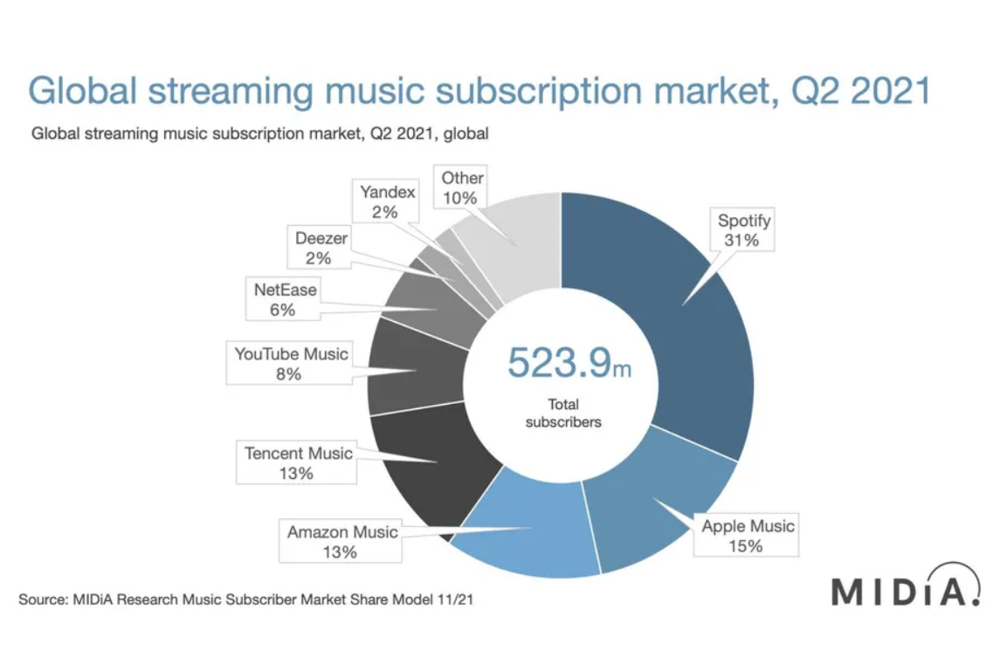

```{r setup, include=FALSE}
# add stuff if needed
```

`TODO` - add used classifiers to the abstract
`TODO` - add short one-sentence results summary to the abstract

# Introduction



Based on the information seen on *Global music streaming market* figure, as of Q2 2021, **Spotify** is the world's biggest music streaming platform out there, surpassing its biggest competitor, **Apple Music** by little over 2 times. According to the same time's shareholder letter earning report, the company made **2,331M€** in revenue. It is no wonder, considering the functionalities and convenience it provides.

One of these functionalities is the **Discover Weekly** - a user-tailored mixtape of new *(in principle, not yet heard by the user)* songs Spotify's recommendations system considers the user will like and enjoy. It enables users to explore new songs without too much effort and is updated every Monday. From user's point of view, the recommendations work the following way:

- during the week, listen to the songs you play (or the ones we suggest if the autoplay is on)
- after we update **Discover Weekly**, listen these songs out
- while listening to the songs recommended by us, depending whether you like them:
  - leave them as they are (the song is considered liked)
  - save them in your playlists (the song is consider even more liked)
  - click **Hide that song** (the song is considered **not** liked)
- based on which song you liked and hid, we will adjust our recommendation system to better suit your taste

Does the recommendation system work well then? Subjectively, **no**. Personally, I am quite a music junkie with a rather *particular* taste in music. **Harder styles** such as Techno, Hardstyle, Hardcore, Gabber, Uptempo, etc. are one of my favorites and take up a big part of my music consumption. I would like to explore new tracks to listen to and thus I give feedback on every song Spotify plays me. However, time and time again the recommendations regarding the mentioned styles is **very** off, with an average accuracy of **just 1/30**.

Unsure of what is the cause of that, I have been thinking about creating my own classification system which could serve the role of tracks recommendation system and comparing it to Spotify's one. Fortunately enough, having learnt about Spotify's API enabling pulling metadata regarding the songs, and given this case study assignment, I have an opportunity to do exactly that.

`TODO` - extract and use in README

# Dataset

## Rough data

`TODO` - detailed description of the dataset and its characteristics

- short description of the dataset (where does it come from, how obtained, etc.)
- examples from the dataset
- interpretation of the attributes
  - types
  - meaning
  - histograms
  - correlations
  - etc.

## Hypothesis

`TODO` - the three (or more?) possible hypothesis
`TODO` - posed classification question

What I presume:
- Spotify recommendations system sucks and could work better
- not enough attributes for specifically harder styles
- I'm too picky

## Cleaning

`TODO` - fill in section if cleaning was done, otherwise remove

## Preprocessing

`TODO` - how the data was preprocessed

- manual removal of unnecessary attributes (possibly by merging them, e.g. artist with title to form "just descriptive" one)
- (possibly) division into subsets (if something interesting across some specific subset)
- making data "nicer" - discretization, etc.

# Classification

`TODO` - main stuff, the juice, the ganja

## Classifier 1

`TODO`

- description
- parameters
- used software/tools
- show & interpret all the interesting knowledge induced by this approach

## Classifier 2

`TODO`

## Classifier 3

`TODO`

## Classifier (?)

`TODO` - add more classifiers if used, remove if just three

## Comparison

`TODO` - comparison of all the above approaches


`TODO` - distinction between classifying the whole thing and the subsets (if they exist)

# Classifiers in practice

`TODO` - apply the classifiers to a new *discover weekly* Spotify's list, check if they did better job than it

# Conclusions

`TODO`

# Resources

1. https://www.theverge.com/2022/1/20/22892939/music-streaming-services-market-share-q2-2021-spotify-apple-amazon-tencent-youtube
