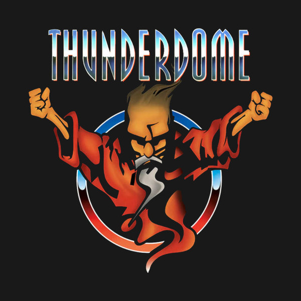
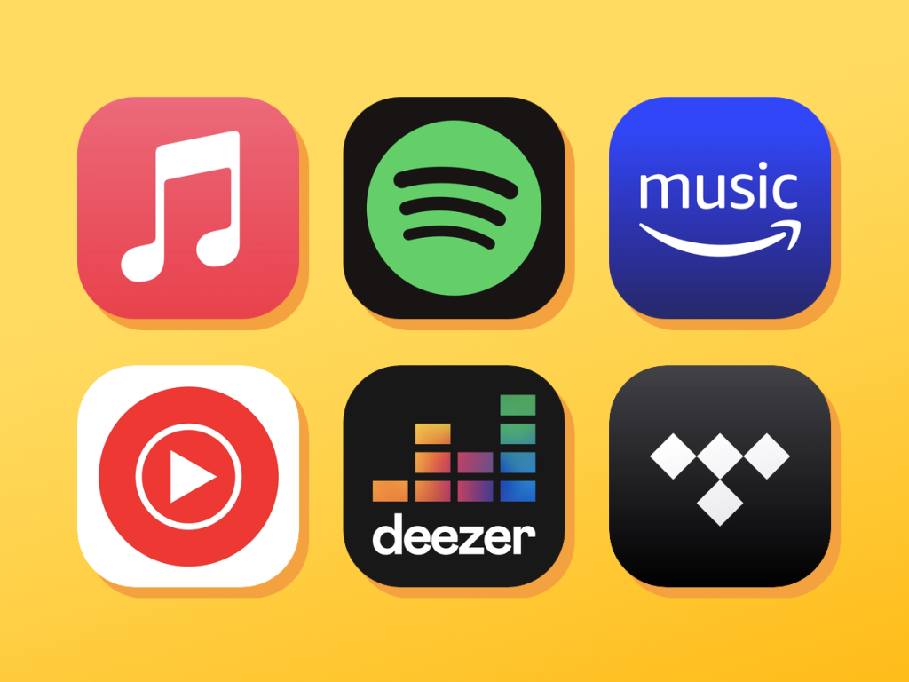
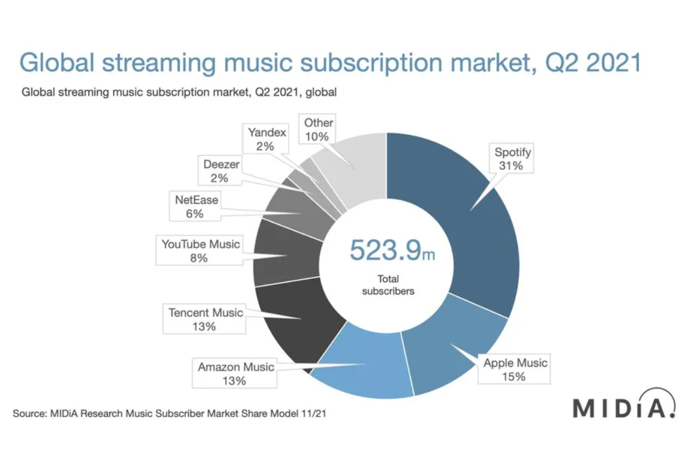

Recommendation of harder styles music on Spotify
========================================================
author: Szymon Bujowski
date: 5/12/2022
autosize: true

Acknowledgements
========================================================

## Artificial Intelligence - Machine Learning classes
## dr hab. inz. Izabela Szczech

===
# Introduction

Music
===

Harder styles
===

What is considered "Harder"?
===

- Techno
- Acid
- Frenchcore
- Hardstyle
- Hardcore
- Gabber
- Piepcore
- Uptempo
- (so on ...)

Music streaming
===

Market share
===

Problem
===

===
# The data

Attributes
========================================================

- meta
  - **name**
  - **artists**
  - **uri**
- **acousticness** - [0.0, 1.0] *(not acoustic, acoustic)*
  - acoustic - primarily uses instruments to produce sound through acoustic means
  - opposite to electric/electronic means
- **danceability** - [0.0, 1.0] *(not good - good)*
- **energy** - [0.0, 1.0] *(not so much, very)*
- **instrumentalness** - [0.0, 1.0] *(lyrical, instrumental)*
- **key** - C, C#, (...), B *[0, 1, (...), 11] mapping, according to standard Pitch Class notation*
- **liveness** - [0.0, 1.0] *(studio recording, live performance)*
- **loudness** - [-inf, inf] *(quiet, loud)*
- **mode** - binary *0: minor, 1: major*
- **speechiness** - [0.0, 1.0] *(no speech detected, speech-intensive)*
- **tempo** - [0.0, inf) *overall estimated tempo in BPM*
- **time_signature** - [0, 1, (...), inf] *number of beats in each bar*
- **valence** - [0.0, 1.0] *(sounds negative, sounds positive)*

===
