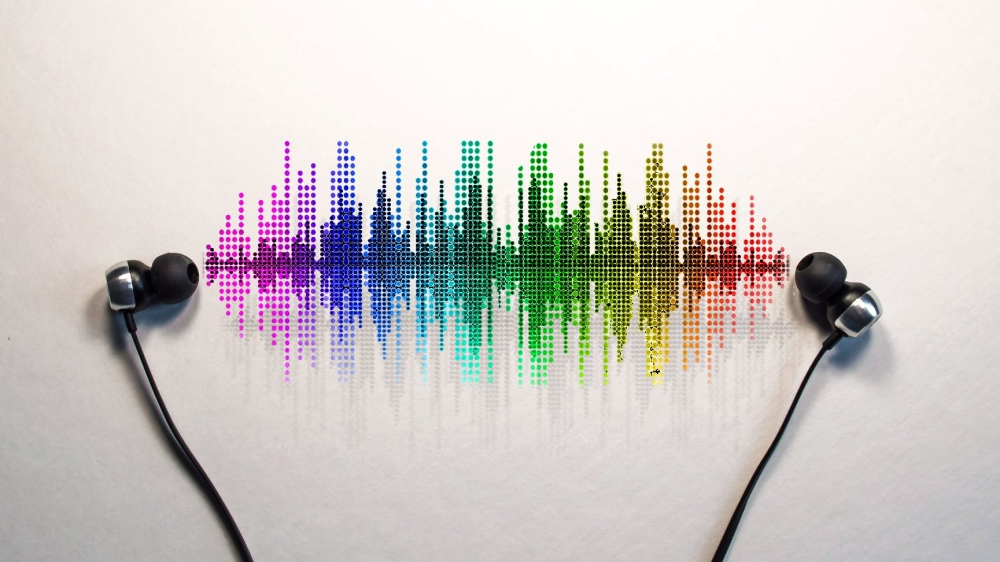

<style>
body {
  overflow-y: auto !important;
}
</style>

Recommendation of harder styles music on Spotify
========================================================
author: Szymon Bujowski
autosize: true

Acknowledgements
========================================================


## Artificial Intelligence - Machine Learning classes
## dr hab. inz. Izabela Szczech

*(disclaimer - for some reason, the surname becomes "Szczech")*

## Where to

[Project is available on GitHub - bujowskis](https://github.com/bujowskis/put-ML-Spotify-case-study)

===
# Introduction

Music
===



Harder styles
===


What is considered "Harder"?
===

- Techno
- Acid
- Frenchcore
- Hardstyle
- Hardcore
- Gabber
- Piepcore
- Uptempo
- (so on ...)

Music streaming
===


Market share
===


Problem
===


Solution
===


===
# The data

Attributes
========================================================

- meta
  - **name**
  - **artists**
  - **uri**
- **acousticness** - [0.0, 1.0] *(not acoustic, acoustic)*
  - acoustic - primarily uses instruments to produce sound through acoustic means
  - opposite to electric/electronic means
- **danceability** - [0.0, 1.0] *(not good - good)*
- **energy** - [0.0, 1.0] *(not so much, very)*
- **instrumentalness** - [0.0, 1.0] *(lyrical, instrumental)*
  - "ooh", "aah", "yeah", (...) are treated as instrumental
- **key** - C, C#, (...), B *[0, 1, (...), 11] mapping, according to standard Pitch Class notation*
- **liveness** - [0.0, 1.0] *(studio recording, live performance)*
- **loudness** - (-inf, **-60, 0**, inf) *(quiet, loud)*
- **mode** - binary *0: minor, 1: major*
- **speechiness** - [0.0, 1.0] *(no speech detected, speech-intensive)*
  - actual speech
  - 1.0 - podcast
- **tempo** - [0.0, inf) *overall estimated tempo in BPM*
- **time_signature** - [0, 1, (...), inf] *number of beats in each bar*
- **valence** - [0.0, 1.0] *(sounds negative, sounds positive)*
- **liked** - binary *True/False*

Working dataset
===


- 420 songs total
- relatively balanced
  - Blue: Liked
  - Red: Disliked

Acousticness
===


- mostly electronic/electric sounds (as expected)

Danceability
===


- similar to normal distribution
- small shift towards **danceable** in **liked**
- unsure about the definition of *danceable*

jumpstyle


shuffle dance


gabber, hakken


Energy
===


- very energetic in general

Instrumentalness
===


- most songs contain vocals
- it seems lower no. of vocals tends to be more liked

Key
===


F - A - A# - C# - G - E - B -  G# -  D - C - F# - D#

- some preference can be seen
  - Like A
  - Like A#
  - Like B
  - Like G#

Liveness
===


- mostly studio recordings (as expected)

Loudness
===


- **loud** side of the spectrum
- it's **not** just about being loud
- Disliked songs are very loud
  - outlier - relatively quiet

Mode
===


Minor - Major

- Minor more or less balanced
- small preference for Major

Speechiness
===


- majority has little to no speech (as expected)

Tempo
===


- 100-145BPM and 160-190BPM seem to be the sweet spots
  - did not expect
  - did not surprise

Time_signature
===


- most songs are made in time signature of 4 (general trend)
- 3 and 1 respectively next in popularity (general trend)

Valence
===


- majority sounds negative (as expected...)

===
# Correlations

(X-axis first, Y-axis second)

Energy - Loudness
===


- louder tracks are more energetic
- nice and expected

Speechiness - Energy
===


- great majority is very energetic
- not energetic are low on speechiness
  - speech gives energy?

(The same goes for Speechiness - Loudness because of Energy - Loudness correlation)

===
# Classification

- 10-Folds Cross-validation for all of the algorithms
- checked lots, elaborated a few chosen

Trees - ranking
===
- 65.7143%: **LMT (default)**
- 64.7619%:
  - **J48 (default)**
  - **J48 (useLaplace)**
- 63.5714%: REPTree (default)
- 62.3810%: J48 (binarySplits)
- 61.9048%:
  - REPTree (pruned)
  - HoeffdingTree (default)
- 61.6667%: RandomForest (default)
- 60.9524%: J48 (unpruned)
- 57.6190%: DecisionStump (default)

LMT - Logistic Model Trees
===
- classification trees with logistic regression functions at the leaves
- 65.7143% accuracy
- seems too shallow to have picked up the general trend

```
Number of Leaves : 	1
Size of the Tree : 	1
```

### The function
- (opposite for Liked/Disliked)

```
LM_1:
Class True :
-1.59 + 
[danceability] * 1.18 +
[instrumentalness] * 0.67 +
[key=A#] * 0.48 +
[speechiness] * 0.87 +
[tempo] * 0.01

Class False :
1.59 + 
[danceability] * -1.18 +
[instrumentalness] * -0.67 +
[key=A#] * -0.48 +
[speechiness] * -0.87 +
[tempo] * -0.01
```

J48
===
- **pruned** or unpruned C4
- preferred (Explainable AI)
- 64.7619% accuracy

## Default parameters

- [GitHub - j48 tree (default) visualization](https://github.com/bujowskis/put-ML-Spotify-case-study/blob/main/presentation/res/j48-tree.png)
- quite large (due to many values for **key**)

```
Number of Leaves : 	34
Size of the tree : 	57
```

## useLaplace

- counts at leaves are smoothed
- very negligible change on the tree, no accuracy improvement

Bayes - ranking
===
- 65.2381%: **BayesNet (BMAEstimator)**
- 64.0476%: **NaiveBayes (useSupervisedDiscretization)**
- 61.6667%: NaiveBayes (useKernelEstimator)
- 59.5238%: NaiveBayes (default)

NaiveBayes
===
- 59.5238% accuracy (default parameters)
- 64.0476% accuracy - **useSupervisedDiscretization** - converts numeric attributes into nominal

### The models (for eager ones)

#### Discretization

```
Naive Bayes Classifier

                          Class
Attribute                  True  False
                         (0.57) (0.43)

acousticness
  'All'                    240.0  182.0
  [total]                  240.0  182.0

danceability
  '(-inf-0.6655]'          181.0  172.0
  '(0.6655-inf)'            60.0   11.0
  [total]                  241.0  183.0

energy
  'All'                    240.0  182.0
  [total]                  240.0  182.0

instrumentalness
  '(-inf-0.000102]'         43.0   79.0
  '(0.000102-inf)'         198.0  104.0
  [total]                  241.0  183.0

key
  F                         15.0   15.0
  A                         26.0   17.0
  A#                        21.0    7.0
  C#                        32.0   34.0
  G                         33.0   29.0
  E                         15.0   13.0
  B                         27.0   14.0
  G#                        16.0   18.0
  D                         20.0   10.0
  C                         15.0   12.0
  F#                        26.0   20.0
  D#                         5.0    4.0
  [total]                  251.0  193.0

liveness
  'All'                    240.0  182.0
  [total]                  240.0  182.0

loudness
  '(-inf--6.3995]'          57.0   10.0
  '(-6.3995-inf)'          184.0  173.0
  [total]                  241.0  183.0

mode
  minor                    113.0   94.0
  major                    128.0   89.0
  [total]                  241.0  183.0

speechiness
  'All'                    240.0  182.0
  [total]                  240.0  182.0

tempo
  '(-inf-155.051]'         148.0  148.0
  '(155.051-189.4515]'      93.0   27.0
  '(189.4515-inf)'           1.0    9.0
  [total]                  242.0  184.0

time_signature
  'All'                    240.0  182.0
  [total]                  240.0  182.0

valence
  'All'                    240.0  182.0
  [total]                  240.0  182.0
```

#### Default parameters (no discretization)

```
Naive Bayes Classifier

                      Class
Attribute              True    False
                     (0.57)   (0.43)

acousticness
  mean                0.0596   0.0536
  std. dev.           0.0882   0.0741
  weight sum             239      181
  precision           0.0014   0.0014

danceability
  mean                0.5584   0.5155
  std. dev.           0.1292   0.1174
  weight sum             239      181
  precision           0.0029   0.0029

energy
  mean                 0.918   0.9299
  std. dev.           0.0908     0.07
  weight sum             239      181
  precision           0.0025   0.0025

instrumentalness
  mean                0.2536   0.1243
  std. dev.           0.3311    0.255
  weight sum             239      181
  precision           0.0031   0.0031

key
  F                     15.0     15.0
  A                     26.0     17.0
  A#                    21.0      7.0
  C#                    32.0     34.0
  G                     33.0     29.0
  E                     15.0     13.0
  B                     27.0     14.0
  G#                    16.0     18.0
  D                     20.0     10.0
  C                     15.0     12.0
  F#                    26.0     20.0
  D#                     5.0      4.0
  [total]              251.0    193.0

liveness
  mean                0.2598   0.2477
  std. dev.           0.2048   0.1891
  weight sum             239      181
  precision           0.0029   0.0029

loudness
  mean                -4.171  -3.0617
  std. dev.           2.9676   2.2127
  weight sum             239      181
  precision           0.0448   0.0448

mode
  minor                113.0     94.0
  major                128.0     89.0
  [total]              241.0    183.0

speechiness
  mean                0.1595   0.1395
  std. dev.           0.1253   0.1124
  weight sum             239      181
  precision           0.0018   0.0018

tempo
  mean              144.9575 135.2028
  std. dev.          27.7091  32.5015
  weight sum             239      181
  precision           0.3253   0.3253

time_signature
  mean                4.4435   4.3591
  std. dev.           0.3168   0.5394
  weight sum             239      181
  precision              1.5      1.5

valence
  mean                0.2408   0.2316
  std. dev.           0.1624   0.1652
  weight sum             239      181
  precision           0.0028   0.0028
```

BayesNet - Bayes Network
===
- 59.5238% accuracy - SimpleEstimator (default)
  - estimates conditional probability tables once the structure has been learned
  - estimates probabilities directly from data
- 65.2381% accuracy - **BMAEstimator**
  - estimates cond. prob. tables using Bayes Model Averaging
  - averaging the estimates (or predictions) of different models under consideration
  - each model weighted by its probability
  - **straightforward model choice criteria**
  - **less risky predictions**
- [Useful manual on BayesNet in weka](https://weka.sourceforge.io/manuals/weka.bn.pdf)

### For the eager

#### Model (default)

```
Bayes Network Classifier
not using ADTree
#attributes=13 #classindex=12
Network structure (nodes followed by parents)
acousticness(1): liked 
danceability(2): liked 
energy(1): liked 
instrumentalness(2): liked 
key(12): liked 
liveness(1): liked 
loudness(2): liked 
mode(2): liked 
speechiness(1): liked 
tempo(3): liked 
time_signature(1): liked 
valence(1): liked 
liked(2): 
LogScore Bayes: -2492.729433970241
LogScore BDeu: -2575.5041163536894
LogScore MDL: -2564.8879764472968
LogScore ENTROPY: -2459.1835189999424
LogScore AIC: -2494.1835189999424
```

#### Model (BMAEstimator)

```
not using ADTree
#attributes=13 #classindex=12
Network structure (nodes followed by parents)
acousticness(1): liked 
danceability(2): liked 
energy(1): liked 
instrumentalness(2): liked 
key(12): liked 
liveness(1): liked 
loudness(2): liked 
mode(2): liked 
speechiness(1): liked 
tempo(3): liked 
time_signature(1): liked 
valence(1): liked 
liked(2): 
LogScore Bayes: -219.4197931728273
LogScore BDeu: -302.1944755562744
LogScore MDL: -403.63391114075176
LogScore ENTROPY: -297.9294536933971
LogScore AIC: -332.9294536933971
```

Rules - ranking
===
- 63.8095%: **DecisionTable (useIBk)**
- 63.5714%: **DecisionTable (default)**
- 62.8571%: **JRip (default)**
- 60.0000%: PART (MDLcorrelation: False)
- 59.5238%: PART (reducedErrorPruning)
- 57.3810%: PART (binarySplits)
- 56.4286%: PART (unpruned)
- 55.2381%: rules-PART-default

DecisionTable
===
- 63.5714% accuracy (default)
- 63.8095% accuracy (useIBk)
  - IBk (K-nearest neighbors classifier) is used instead of the majority class
- both options produced **the same** Decision Table
- **different scores** on cross-validation
- seems too simple - definitely more goes into what I like 

### Model
```
Decision Table:

Number of training instances: 420
Number of Rules : 6
Non matches covered by IB1 (OR Majority class).
	Best first.
	Start set: no attributes
	Search direction: forward
	Stale search after 5 node expansions
	Total number of subsets evaluated: 67
	Merit of best subset found:   70    
Evaluation (for feature selection): CV (leave one out) 
Feature set: 4,10,13

Rules:

instrumentalness     tempo                liked  

'(-inf-0.000102]'    '(189.4515-inf)'     True
'(0.000102-inf)'     '(189.4515-inf)'     False
'(-inf-0.000102]'    '(155.051-189.4515]' True
'(0.000102-inf)'     '(155.051-189.4515]' True
'(-inf-0.000102]'    '(-inf-155.051]'     False
'(0.000102-inf)'     '(-inf-155.051]'     True
```

JRip
===
- propositional rule learner
- Repeated Incremental Pruning to Produce Error Reduction (RIPPER)

### Model
- two rules removing disliked
- everything else is liked

```
JRIP rules:

1. (instrumentalness <= 0.0001) and (speechiness <= 0.181) => liked=False (80.0/19.0)

2. (loudness >= -4.485) and (acousticness <= 0.0336) and (tempo <= 155.047) and
(speechiness >= 0.125) and (danceability <= 0.684) => liked=False (35.0/6.0)

3. => liked=True (305.0/91.0)

Number of Rules : 3
```

Lazy - ranking
===
- 64.0476%: **LWL (J48)**
- 62.8571%:
  - **LWL (default)**
  - LWL (RandomForest) - `NOTE - very slow`
- 59.2857%: KStar (default)
- 58.0952%: IBk (default)

LWL - Locally Weighted Learning
===
- uses instance-based algorithm to assign instance weights
- instance weights used by other algorithms
- 62.8571% (default - DecisionStump)
- 64.0476% (J48)
  - **worse** accuracy than J48 standalone

Cross-validation - ranking of "the chosen"
===
- max **Precision (True)**
  - if something is recommended, I'd rather like it
- focus on left part of the confusion matrix

```
   a   b   <-- classified as
 172  67 |   a = True
  79 102 |   b = False
```

- accuracy is welcome, but less important


Real-life validation
===
- dataset of 69 songs from 3 *"Discover Weekly"* consecutive playlists
  - 21 songs removed (not harder styles)
  - 4 liked, **65 disliked**
      - kudos for AI
  
  
  
- baseline - Precision (True) = 4/69 = **5.8% (!)**

Real-life validation - classifiers' results
===
*(brace yourselves)*

## Precision (True)
1. **8.2%** - BayesNet (BMAEstimator)
2. 7.0%
  - J48
  - NaiveBayes (useSupervisedDiscretization)
3. 6.8% - LWL (J48)
4. 6.3%
  - LMT (default)
  - DecisionTable (useIBk)
  - JRip (default)
  - DecisionTable (default)
  - LWL (default)

## .     .     .
- + all better than Spotify
- **- still bad...**

How bad is it?
===

## OneR

### Training

```
tempo:
	< 94.2245	-> False
	< 94.9885	-> True
	< 95.0295	-> False
	< 99.9505	-> True
	< 99.9825	-> False
	< 100.01050000000001	-> True
	< 102.515	-> False
	< 148.0355	-> True
	< 149.9565	-> False
	< 150.0325	-> True
	< 150.1355	-> False
	< 153.5425	-> True
	< 155.058	-> False
	< 189.4515	-> True
	>= 189.4515	-> False
(304/420 instances correct)
```

### Real-life

**7.1% (!)** Precision (True)

- beat every applied model except BayesNet (BMAEstimator)
- obviosuly, not nearly close to grasping the general concept

Real-life validation - DISCLAIMER
===
A few notions to be made regarding real-life validation
- Spotify may value FP over FN
  - **explore** - show (not like) >>> don't show (would have liked)
  - BUT **Discover** Weekly is about tracks **I should like, but haven't heard yet**
- Validation with spotify's recommendation is difficult and may be somehow inconclusive
  - only insight into TP and FP
  - how many FP and FN?
- Spotify deals with **all** the songs, not a nice subset of similar ones
  - what about Heavy Metal?
  - what about Alternative?
  - (...)
  - may spoil the algorithms (different approach towards different subsets)

The "Why?"
===
**Model** of a song **not complex enough** - music is much more than this set of features
- mapping different songs into similar features values
- not expressing many (potentially important) factors
  - history
  - memories
  - emotions
  - types of sounds
  - (...)

*it may also be that I'm picky...*

Final thoughts
===
### Stop complaining, start exploring!

Perhaps with [Journey through the harder styles - by yours truly](https://open.spotify.com/playlist/29e9lxxlte7IE7dwrSHhKP?si=8cb47c03fee54173)

*or hare's an idea - try and create your own classification system...*
