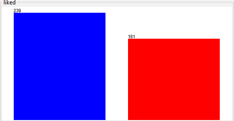

Recommendation of harder styles music on Spotify
========================================================
author: Szymon Bujowski
date: 5/12/2022
autosize: true

Acknowledgements
========================================================

## Artificial Intelligence - Machine Learning classes
## dr hab. inz. Izabela Szczech

===
# Introduction

Music
===

Harder styles
===

What is considered "Harder"?
===

- Techno
- Acid
- Frenchcore
- Hardstyle
- Hardcore
- Gabber
- Piepcore
- Uptempo
- (so on ...)

Music streaming
===

Market share
===

Problem
===

===
# The data

Attributes
========================================================

- meta
  - **name**
  - **artists**
  - **uri**
- **acousticness** - [0.0, 1.0] *(not acoustic, acoustic)*
  - acoustic - primarily uses instruments to produce sound through acoustic means
  - opposite to electric/electronic means
- **danceability** - [0.0, 1.0] *(not good - good)*
- **energy** - [0.0, 1.0] *(not so much, very)*
- **instrumentalness** - [0.0, 1.0] *(lyrical, instrumental)*
- **key** - C, C#, (...), B *[0, 1, (...), 11] mapping, according to standard Pitch Class notation*
- **liveness** - [0.0, 1.0] *(studio recording, live performance)*
- **loudness** - (-inf, **-60, 0**, inf) *(quiet, loud)*
- **mode** - binary *0: minor, 1: major*
- **speechiness** - [0.0, 1.0] *(no speech detected, speech-intensive)*
- **tempo** - [0.0, inf) *overall estimated tempo in BPM*
- **time_signature** - [0, 1, (...), inf] *number of beats in each bar*
- **valence** - [0.0, 1.0] *(sounds negative, sounds positive)*
- **liked** - binary *True/False*

Working dataset
===

- 420 songs total
- relatively balanced
  - Blue: Liked
  - Red: Disliked

Acousticness
===

- mostly electronic/electric sounds (as expected)

Danceability
===

- similar to normal distribution
- small shift towards **danceable** in **liked**
- unsure about the definition of *danceable*

jumpstyle

shuffle dance

gabber, hakken

Energy
===

- very energetic in general

Instrumentalness
===

- most songs contain vocals
- it seems lower no. of vocals tends to be more liked

Key
===

F - A - A# - C# - G - E - B -  G# -  D - C - F# - D#

- some preference can be seen
  - Like A
  - Like A#
  - Like B
  - Like G#

Liveness
===

- mostly studio recordings (as expected)

Loudness
===

- **loud** side of the spectrum
- it's **not** just about being loud
- Disliked songs are very loud
  - outlier - relatively quiet

Mode
===

Minor - Major

- Minor more or less balanced
- small preference for Major

Speechiness
===

- majority has little to no speech (as expected)

Tempo
===

- 100-145BPM and 160-190BPM seem to be the sweet spots (more or less expected)

Time_signature
===

- most songs are made in time signature of 4 (general trend)
- 3 and 1 respectively next in popularity (general trend)

Valence
===

- majority sounds negative (as expected)

===
# Correlations

(X-axis first, Y-axis second)

Energy - Loudness
===

- louder tracks are more energetic
- nice and expected

Speechiness - Energy
===

- great majority is very energetic
- not energetic are low on speechiness
  - speech gives energy?

(The same goes for Speechiness - Loudness because of Energy - Loudness correlation)

===
# Classification

- 10-Folds Cross-validation for all of the algorithms

J48
===
